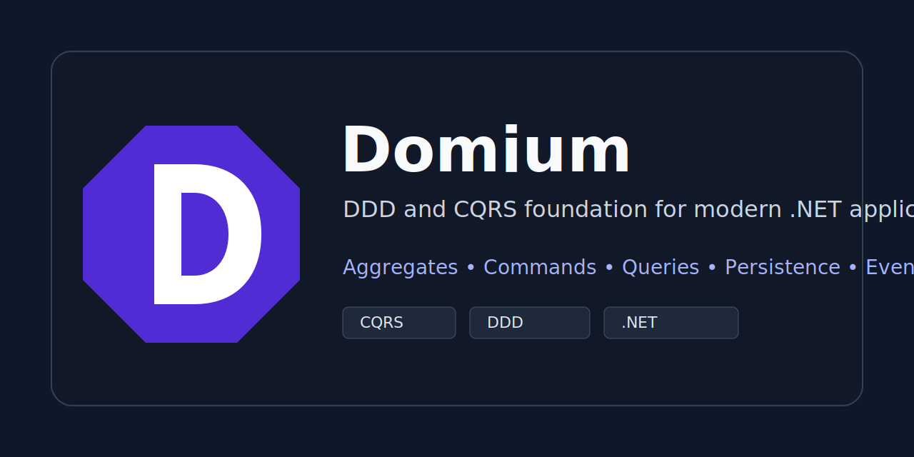

<p align="center">
  
</p>

# Domium

<p align="center">
  
</p>

Domium is a lightweight DDD and CQRS foundation for modern .NET applications. It gives you focused building blocks for aggregate modeling, command and query pipelines, provider-selectable persistence, tenant-aware caching, eventing, and observability without forcing one infrastructure style on every application.

## Why Domium

- Model domain objects with aggregate roots, strongly typed IDs, value objects, audit metadata, soft delete support, and domain events.
- Use a small CQRS application layer with command/query buses, validation, logging, transactions, and query caching behaviors.
- Choose persistence per application: EF Core, Dapper, or both.
- Keep read models independent from aggregate repositories.
- Add provider packages only when needed: Redis, MassTransit, OpenTelemetry, EF Core, Dapper.
- Publish and version each package independently through NuGet.

## Package Map

| Package | Purpose |
| --- | --- |
| `Domium.Domain.Abstractions` | Domain contracts for entities, aggregate roots, IDs, value objects, and domain events. |
| `Domium.Domain` | Concrete domain primitives such as `AggregateRoot<TId>`, `EntityBase<TId>`, `AggregateId<T>`, and `DomainEvent`. |
| `Domium.Configuration` | Core composition options and registration pipeline used by `AddDomium`. |
| `Domium.Application.Abstractions` | Command/query buses, handlers, validators, and pipeline contracts. |
| `Domium.Application` | Command/query buses, pipeline behaviors, and domain event dispatching. |
| `Domium.Facade.Abstractions` | Facade marker contract for exposing one module-level API to other layers. |
| `Domium.Facade` | Base facade helper that delegates to command and query buses while keeping CQRS inside the application layer. |
| `Domium.Persistence.Abstractions` | Provider-neutral aggregate repository and unit-of-work contracts. |
| `Domium.Persistence.EntityFrameworkCore` | EF Core aggregate repository, DbContext base, unit of work, and EF-specific specifications. |
| `Domium.Persistence.Dapper` | Dapper session, SQL executor, unit of work, and optional mapped aggregate repository. |
| `Domium.Caching.Abstractions` | Cache store, policy, key, scope, and invalidation abstractions. |
| `Domium.Caching` | Default cache policy, key, scope, and invalidation providers. |
| `Domium.Caching.Memory` | In-memory cache store provider. |
| `Domium.Caching.Redis` | Redis cache store provider. |
| `Domium.Eventing.Abstractions` | Internal and external event contracts. |
| `Domium.Eventing` | In-process internal event publishing and default no-op external publisher. |
| `Domium.Eventing.MassTransit` | MassTransit external event publishing and consumer adapter. |
| `Domium.Tenancy.Abstractions` | Tenant context contracts. |
| `Domium.Tenancy` | AsyncLocal tenant context and disposable tenant scopes. |
| `Domium.Observability` | ActivitySource, Meter, counters, and histograms. |
| `Domium.Observability.OpenTelemetry` | OpenTelemetry tracing and metrics registration. |
| `Domium.Extensions.DependencyInjection` | Main `AddDomium` composition entry point. |

## Installation

Install the packages you need. A typical application starts with:

```powershell
dotnet add package Domium.Domain
dotnet add package Domium.Application
dotnet add package Domium.Configuration
dotnet add package Domium.Facade
dotnet add package Domium.Extensions.DependencyInjection
```

Then add persistence and provider packages as needed:

```powershell
dotnet add package Domium.Persistence.EntityFrameworkCore
dotnet add package Domium.Persistence.Dapper
dotnet add package Domium.Caching.Redis
dotnet add package Domium.Eventing.MassTransit
dotnet add package Domium.Observability.OpenTelemetry
```

## Quick Start

Register Domium with the fluent API:

```csharp
using Domium.Configuration;
using Domium.Extensions.DependencyInjection;

services.AddDomium(options =>
{
    options
        .UseValidation()
        .UseLogging()
        .UseTransactions()
        .UseCaching(cache =>
        {
            cache.Provider = DomiumCacheProvider.Memory;
            cache.DefaultExpiration = TimeSpan.FromMinutes(5);
        });
});
```

`AddDomium` scans loaded non-framework application assemblies by default, so most applications do not need to pass an assembly manually. When handlers live in an assembly that is not loaded yet, register it explicitly:

```csharp
services.AddDomium(options =>
{
    options.AddApplicationAssembly(typeof(CreateOrderHandler).Assembly);
});
```

Feature toggles accept explicit booleans:

```csharp
services.AddDomium(options =>
{
    options
        .UseValidation()
        .UseLogging(false)
        .UseTransactions(false)
        .UseCaching(enabled: false);
});
```

## Domain Model

```csharp
public sealed class OrderId(Guid value) : AggregateId<Guid>(value);

public sealed class Order : AggregateRoot<OrderId>
{
    private Order() : base(new OrderId(Guid.Empty))
    {
        Number = string.Empty;
    }

    public Order(OrderId id, string number) : base(id)
    {
        Number = number;
        RaiseDomainEvent(new OrderCreatedDomainEvent(id));
    }

    public string Number { get; private set; }
}

public sealed class OrderCreatedDomainEvent(OrderId orderId) : DomainEvent
{
    public OrderId OrderId { get; } = orderId;
}
```

## Commands And Queries

Commands change the domain model:

```csharp
public sealed record CreateOrderCommand(string Number) : ICommand;

public sealed class CreateOrderHandler(IRepository<Order, OrderId> repository)
    : ICommandHandler<CreateOrderCommand>
{
    public Task HandleAsync(
        CreateOrderCommand command,
        CancellationToken cancellationToken = default)
    {
        var order = new Order(new OrderId(Guid.NewGuid()), command.Number);
        return repository.AddAsync(order, cancellationToken);
    }
}
```

Queries return read models or DTOs:

```csharp
public sealed record GetOrderQuery(Guid Id) : IQuery<OrderReadModel>;

public sealed record OrderReadModel(Guid Id, string Number);
```

## Facades

Facades provide one module-level dependency to other layers while CQRS stays enforced in the application layer.

```csharp
public interface IOrderFacade : IFacade
{
    Task CreateAsync(CreateOrderRequest request, CancellationToken cancellationToken = default);

    Task<OrderReadModel> GetAsync(Guid id, CancellationToken cancellationToken = default);
}

public sealed class OrderFacade(ICommandBus commandBus, IQueryBus queryBus)
    : DomiumFacade(commandBus, queryBus), IOrderFacade
{
    public Task CreateAsync(CreateOrderRequest request, CancellationToken cancellationToken = default)
    {
        return ExecuteAsync(new CreateOrderCommand(request.Number), cancellationToken);
    }

    public Task<OrderReadModel> GetAsync(Guid id, CancellationToken cancellationToken = default)
    {
        return QueryAsync<GetOrderQuery, OrderReadModel>(new GetOrderQuery(id), cancellationToken);
    }
}
```

## Persistence

Domium keeps the core repository intentionally small:

```csharp
IRepository<TAggregate, TId>
```

This repository is for aggregate load/save behavior. Provider-specific querying belongs to the provider package or to query handlers.

### EF Core

```csharp
services.AddDomiumEntityFrameworkCore<AppDbContext>(options =>
{
    options.UseSqlServer(connectionString);
});

services.AddDomium(options => options.UseTransactions());
```

Use the core repository for aggregate persistence:

```csharp
var order = await repository.GetByIdAsync(orderId, cancellationToken);
await repository.UpdateAsync(order, cancellationToken);
```

EF-specific specifications are available through `IEfRepository<TAggregate, TId>`:

```csharp
var orders = await efRepository.FindAsync(
    new ActiveOrdersSpecification(),
    cancellationToken);
```

### Dapper

Dapper can be used for explicit SQL in query handlers:

```csharp
var orders = await sql.QueryAsync<OrderReadModel>(
    "select Id, Number from Orders where TenantId = @TenantId",
    new { TenantId = tenantId },
    cancellationToken);
```

Register Dapper infrastructure:

```csharp
services.AddDomiumDapper(options =>
{
    options.UseConnectionFactory<SqlConnectionFactory>();
});
```

If the application wants Dapper as the aggregate repository provider, opt in and supply explicit aggregate mapping:

```csharp
services.AddScoped<IDapperAggregateMapper<Order, OrderId>, OrderMapper>();

services.AddDomiumDapper(options =>
{
    options
        .UseConnectionFactory<SqlConnectionFactory>()
        .UseAggregateRepositories();
});
```

The mapper owns SQL and materialization:

```csharp
public sealed class OrderMapper : IDapperAggregateMapper<Order, OrderId>
{
    public string SelectByIdSql => "select Id, Number from Orders where Id = @Id";
    public string InsertSql => "insert into Orders (Id, Number) values (@Id, @Number)";
    public string UpdateSql => "update Orders set Number = @Number where Id = @Id";
    public string DeleteSql => "delete from Orders where Id = @Id";

    public object GetIdParameters(OrderId id) => new { Id = id.Value };
    public object GetInsertParameters(Order order) => new { Id = order.Id.Value, order.Number };
    public object GetUpdateParameters(Order order) => new { Id = order.Id.Value, order.Number };
    public object GetDeleteParameters(Order order) => new { Id = order.Id.Value };

    public Order Map(object row)
    {
        // Map from the provider row shape into the aggregate.
        throw new NotImplementedException();
    }
}
```

## Query Caching

Use in-memory caching:

```csharp
services.AddDomium(options =>
{
    options.UseCaching(cache =>
    {
        cache.Provider = DomiumCacheProvider.Memory;
        cache.DefaultExpiration = TimeSpan.FromMinutes(5);
    });
});
```

Use Redis caching:

```csharp
services.AddDomium(options =>
{
    options.UseCaching(cache =>
    {
        cache.Provider = DomiumCacheProvider.Redis;
        cache.RedisConnectionString = "localhost";
        cache.DefaultExpiration = TimeSpan.FromMinutes(5);
    });
});
```

Register query cache policies through `IDomiumQueryCachePolicyRegistry`.

## Tenancy

Tenant scope is ambient and async-flow aware:

```csharp
using var scope = tenantScopeFactory.BeginScope("tenant-42");
```

Tenant-scoped cache policies fail clearly when no tenant context exists.

## Eventing

Internal events are in-process. External events are transport-provider specific.

```csharp
services.AddDomiumMassTransitEventing();

services.AddMassTransit(configurator =>
{
    configurator.AddDomiumExternalEventConsumer<OrderSubmitted>();
    configurator.UsingRabbitMq((context, cfg) => cfg.ConfigureEndpoints(context));
});
```

## Observability

```csharp
using Domium.Observability.OpenTelemetry;

services.AddDomiumOpenTelemetry(options =>
{
    options.ServiceName = "Orders.Api";
    options.Environment = "Production";
    options.Otlp.Enabled = true;
    options.Otlp.Endpoint = "http://localhost:4317";
});
```

Domium emits activities and metrics under the `Domium` source/meter.

## Documentation

- [Architecture](docs/architecture.md)
- [Persistence](docs/persistence.md)
- [Publishing Packages](docs/publishing.md)

## Build

```powershell
dotnet restore Domium.slnx
dotnet build Domium.slnx --configuration Release --no-restore
dotnet test Domium.slnx --configuration Release --no-build
dotnet pack Domium.slnx --configuration Release --no-build --output artifacts/packages
```

## License

Domium is licensed under the MIT license.
