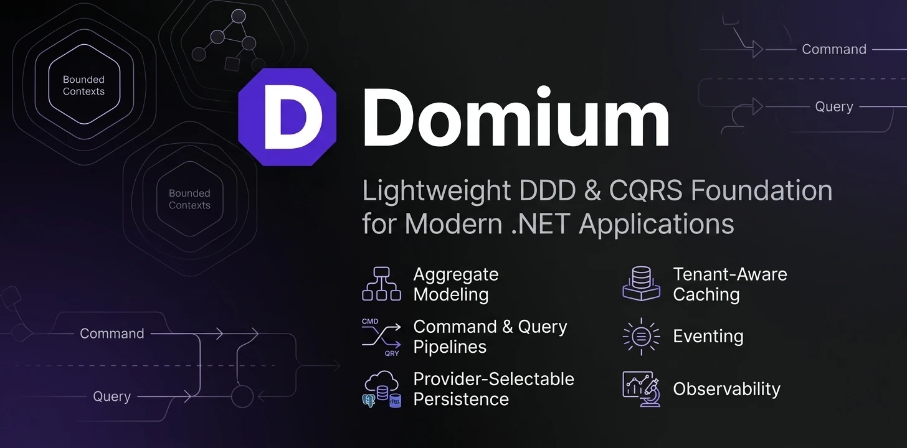

<p align="center">
  
</p>

<h1 align="center">Domium</h1>

<p align="center">
  <b>A lightweight DDD + CQRS foundation for modern .NET</b><br/>
  Aggregates, command/query pipelines, provider-selectable persistence, multi-tenancy,<br/>
  simple tag-based caching, eventing, and observability — as small, composable NuGet packages.
</p>

<p align="center">
  <a href="https://www.nuget.org/packages?q=Domium"></a>
  
  <a href="LICENSE"></a>
</p>

---

Domium gives you the building blocks of a clean, domain-driven service without forcing one
infrastructure style on every application. Take only the packages you need — the domain
model has no dependency on EF Core, Redis, or MassTransit; providers plug in from the
outside.

```csharp
// A domain that reads like the business…
public sealed class Order : AggregateRoot<OrderId>
{
    public Order(CustomerId customerId) : base(new OrderId())
    {
        CustomerId = customerId;
        Status = OrderStatus.Draft;
        RaiseEvent(new OrderCreatedDomainEvent(Id.Value));
    }

    public void Submit()
    {
        if (Status != OrderStatus.Draft)
            throw new DomainException("Only draft orders can be submitted.");

        Status = OrderStatus.Submitted;
        RaiseEvent(new OrderSubmittedDomainEvent(Id.Value));
    }
}

// …an application layer that stays thin…
public sealed record CreateOrderCommand(Guid CustomerId) : ICommand<Guid>;

public sealed class CreateOrderCommandHandler(OrdersDbContext db) : ICommandHandler<CreateOrderCommand, Guid>
{
    public async Task<Guid> HandleAsync(CreateOrderCommand command, CancellationToken cancellationToken = default)
    {
        var order = new Order(new CustomerId(command.CustomerId));
        db.Orders.Add(order);
        await db.SaveChangesAsync(cancellationToken);
        return order.Id.Value;
    }
}

// …and one registration call that wires the pipeline.
services.AddDomium(options => options
    .AddApplicationAssembly(typeof(CreateOrderCommandHandler).Assembly)
    .UseObservability()
    .UseValidation()
    .UseLogging()
    .UseTransactions());
```

## Contents

- [Why Domium](#why-domium)
- [Installation](#installation)
- [The command & query pipeline](#the-command--query-pipeline)
- [Domain model & events](#domain-model--events)
- [Persistence](#persistence)
- [Multi-tenancy](#multi-tenancy)
- [Caching](#caching)
- [Idempotent commands](#idempotent-commands)
- [Dynamic querying](#dynamic-querying)
- [Observability](#observability)
- [Package map](#package-map)

## Why Domium

- **Small pieces, explicit composition.** Every concern is its own package with an
  `.Abstractions` split; your domain and application projects reference only contracts.
- **A real pipeline.** Observability, validation, logging, idempotency, and transactions are
  pipeline behaviors around your handlers — added per application with one `Use*()` call each.
- **Transactional domain events.** Domain event handlers run in the same DI scope and
  DbContext as the command that raised them: one transaction, no dual writes.
- **Provider choice.** EF Core or Dapper for writes; memory or Redis for caching; MassTransit
  for integration events — swap without touching domain code.
- **Multi-tenant by convention.** One database per tenant, named `{tenant}_{service}`,
  resolved once per request from the ambient tenant. No tenant ids threaded through code.
- **Safe dynamic queries.** Filtering/sorting/paging from query strings with an explicit
  attribute allow-list — nothing is queryable by accident.

## Installation

```powershell
# the core
dotnet add package Domium.Domain
dotnet add package Domium.Application
dotnet add package Domium.Extensions.DependencyInjection

# providers, as needed
dotnet add package Domium.Persistence.EntityFrameworkCore   # or Domium.Persistence.Dapper
dotnet add package Domium.Caching.Redis                     # or Domium.Caching.Memory
dotnet add package Domium.Eventing.MassTransit
dotnet add package Domium.Observability.OpenTelemetry
dotnet add package Domium.Querying.EntityFrameworkCore
```

## The command & query pipeline

Handlers are discovered from the assemblies you register. Cross-cutting behaviors wrap them
in a fixed, sensible order — each one opt-in:

```
ObservabilityBehavior        ← span + metrics around everything
  ValidationBehavior         ← all ICommandValidator<T> / IQueryValidator<T,R>
    LoggingBehavior
      IdempotencyBehavior    ← duplicate suppression (commands)
        TransactionBehavior  ← unit of work Begin/Commit/Rollback (commands)
          → your handler
      CachingBehavior        ← ICacheableQuery results (queries)
```

Commands come in two shapes — fire-and-forget and result-returning:

```csharp
public sealed record RenameFleetCommand(Guid FleetId, string Name) : ICommand;
public sealed record CreateOrderCommand(Guid CustomerId) : ICommand<Guid>;

await commands.ExecuteAsync(new RenameFleetCommand(id, "North"), cancellationToken);
var orderId = await commands.ExecuteAsync<CreateOrderCommand, Guid>(new(customerId), cancellationToken);
```

Queries are unconstrained in their result type, so nullable and value-type results are
first-class:

```csharp
public sealed record GetOrderQuery(Guid OrderId) : IQuery<OrderDto?>;
public sealed record CountOpenOrdersQuery() : IQuery<int>;
```

## Domain model & events

`AggregateRoot<TId>`, `EntityBase<TId>`, `AggregateId<T>`, and `ValueObject` cover identity,
equality, and event raising. Strongly-typed ids are single-line classes:

```csharp
public sealed class OrderId(Guid value) : AggregateId<Guid>(value)
{
    public OrderId() : this(Guid.CreateVersion7()) { }
}
```

Domium distinguishes **two kinds of events**:

| Kind | Contract | Dispatch | Consistency |
| --- | --- | --- | --- |
| Domain event | `IDomainEvent` | In-process, same DI scope | Same DbContext → same transaction as the aggregate change |
| Integration event | `IExternalEvent` | MassTransit | Use MassTransit's EF outbox for exactly-once delivery |

Domain events raised by aggregates loaded from the database publish immediately (the EF
materialization interceptor attaches the event bus). Aggregates created with `new` buffer
their events; `DomainEventDispatchInterceptor` publishes them right before `SaveChanges` —
still in the same scope and transaction. Either way, a handler's changes commit atomically
with the aggregate's. One rule: **domain event handlers must not call `SaveChanges`**.

```csharp
public sealed class OrderCreatedHandler(OrdersDbContext db) : IDomainEventHandler<OrderCreatedDomainEvent>
{
    public Task HandleAsync(OrderCreatedDomainEvent @event, CancellationToken cancellationToken = default)
    {
        db.OutboxNotifications.Add(Notification.For(@event));   // same transaction as the order
        return Task.CompletedTask;
    }
}
```

## Persistence

### EF Core

```csharp
services.AddDomiumEntityFrameworkCore<OrdersDbContext>(options => options.UseNpgsql(connectionString));
```

That one call registers the context as `DomiumDbContext`, the unit of work, generic
repositories, and Domium's interceptors (auditing, soft delete, domain event dispatch,
domain service injection).

- **Repositories.** `IRepository<TAggregate, TId>` is the provider-neutral core
  (`GetById/Add/Update/Remove`); `ISpecificationRepository<TAggregate, TId>` adds
  `Find/Count/Any` over specifications.
- **Specifications** describe a query once, reusable everywhere:

```csharp
public sealed class OverdueOrdersSpec : Specification<Order>
{
    public OverdueOrdersSpec(DateTimeOffset asOf)
    {
        AddCriteria(o => o.DueAtUtc < asOf && o.Status == OrderStatus.Submitted);
        ApplyOrderBy(o => o.DueAtUtc);
        ApplyPaging(skip: 0, take: 100);
    }
}

var overdue = await repository.FindAsync(new OverdueOrdersSpec(clock.UtcNow), cancellationToken);
```

- **Mapping.** Derive entity configurations from `BaseAggregateConfiguration<T>`: it maps
  the table/schema, converts strongly-typed ids (compiled, no per-row reflection), adds
  audit/soft-delete shadow columns, and applies a global query filter so soft-deleted rows
  never surface (opt out per query with `IgnoreQueryFilters()`).
- **Dapper.** `Domium.Persistence.Dapper` implements the same `IRepository` core over
  explicit SQL mappers, plus a session/unit-of-work for hand-written data access.

## Multi-tenancy

Domium's tenancy is **database-per-tenant, resolved once per request**. The tenant id (for
example from a claim) is placed in an ambient context; from there the database name follows
the `{tenant}_{service}` convention — tenant `acme` on service `orders` uses `acme_orders`.

```csharp
// registration: one line per DbContext
services.AddDomiumTenantDbContext<OrdersDbContext>(
    "orders",
    baseConnectionString,
    (options, connectionString) => options.UseNpgsql(connectionString));

// request pipeline: resolve the tenant once
app.Use(async (context, next) =>
{
    var tenant = context.RequestServices.GetRequiredService<IDomiumTenantResolver>().ResolveTenantId();
    if (!string.IsNullOrWhiteSpace(tenant))
    {
        using var scope = context.RequestServices
            .GetRequiredService<IDomiumTenantScopeFactory>()
            .BeginScope(tenant);
        await next(context);
        return;
    }

    await next(context);
});
```

Because every tenant has its own database, **no `TenantId` columns, filters, or parameters
are needed anywhere** in your domain, handlers, or queries. Background workers pick a tenant
explicitly with `IDomiumTenantScopeFactory.BeginScope(tenantId)`; provisioning resolves a
connection for a not-yet-ambient tenant via `IDomiumTenantConnectionResolver.ResolveFor(...)`.

## Caching

One interface, tag-based invalidation, opt-in per query:

```csharp
public interface IDomiumCache
{
    Task<DomiumCacheResult<T>> GetAsync<T>(string key, CancellationToken cancellationToken = default);
    Task SetAsync<T>(string key, T value, DomiumCacheEntryOptions options, CancellationToken cancellationToken = default);
    Task<bool> TrySetAsync<T>(string key, T value, DomiumCacheEntryOptions options, CancellationToken cancellationToken = default);
    Task RemoveAsync(string key, CancellationToken cancellationToken = default);
    Task RemoveByTagAsync(string tag, CancellationToken cancellationToken = default);
}
```

A query opts into caching by implementing `ICacheableQuery`; the pipeline does the rest:

```csharp
public sealed record ListFleetsQuery() : IQuery<IReadOnlyList<FleetDto>>, ICacheableQuery
{
    public TimeSpan? Duration => TimeSpan.FromMinutes(2);
    public IReadOnlyCollection<string> Tags => new[] { "fleets" };
}

// a command handler invalidates by tag:
await cache.RemoveByTagAsync("fleets", cancellationToken);
```

Enable it with a store:

```csharp
options.UseCaching(cache => cache.Store.UseRedis("localhost:6379"));   // or .UseMemory()
```

The Redis store writes values and tag sets transactionally with matching TTLs; the memory
store keeps its tag index consistent under one lock. `TrySetAsync` is atomic on both
(`SET NX` on Redis) — the same primitive idempotency uses.

## Idempotent commands

```csharp
public sealed record PayInvoiceCommand(Guid InvoiceId, string IdempotencyKey)
    : ICommand, IIdempotentCommand;

options.UseIdempotency(idempotency =>
{
    idempotency.Store.UseRedis("localhost:6379");   // distributed reservation
    idempotency.Expiration = TimeSpan.FromHours(24);
});
```

A duplicate of a **completed** command is silently suppressed; a duplicate of a command that
is **still running** (or whose outcome is unknown after a crash) throws, so callers never
mistake an unknown outcome for success. Use the Redis store whenever more than one instance
handles commands.

## Dynamic querying

Bind `QueryOptions` on an endpoint and let clients filter, sort, and page — against an
explicit allow-list, so nothing is queryable unless you mark it:

```csharp
public sealed class OrderDto
{
    [Filterable(FilterOperator.Eq, FilterOperator.In)]
    public Guid CustomerId { get; init; }

    [Filterable] [Sortable]
    public decimal Price { get; init; }

    [Filterable(FilterOperator.Contains, FilterOperator.Eq)] [Sortable]
    public string Name { get; init; } = "";

    [Sortable]
    public DateTimeOffset CreatedAt { get; init; }
}

app.MapGet("/orders", (OrdersDbContext db, [AsParameters] QueryOptions options, CancellationToken ct) =>
    db.Orders.Select(o => new OrderDto { ... }).ApplyQueryOptionsAsync(options, ct));
```

```
GET /orders?filters=Price:Gt:100,Name:Contains:chair&sortBy=-CreatedAt,Name&page=2&pageSize=20
```

| Piece | Syntax | Example |
| --- | --- | --- |
| Filter | `Field:Operator:Value`, comma-separated | `Price:Gt:100,Name:Contains:chair` |
| Operators | `Eq Ne Gt Gte Lt Lte Contains StartsWith EndsWith In Between` | `Id:In:1\|2\|3`, `Price:Between:10\|100` |
| Sort | comma-separated keys, `-` for descending | `-CreatedAt,Name` |
| Paging | `page`, `pageSize` | `page=2&pageSize=20` |

Values convert with invariant culture and understand `Guid`, enums, `DateTime`,
`DateTimeOffset`, `TimeSpan`, and all primitives. Nested paths use dots
(`Category.Name:Eq:Shoes`). Invalid fields, operators, or values throw `ArgumentException` —
map it to a 400.

## Observability

Observability is a pipeline behavior like everything else:

```csharp
options.UseObservability();
```

Every command and query gets an `Activity` span (`domium.command.execute` /
`domium.query.execute`), success counters, and a duration histogram from the `"Domium"`
`ActivitySource`/`Meter`. Event publishing is traced the same way. Hook it into OpenTelemetry
with the provider package:

```csharp
services.AddDomiumOpenTelemetry();   // Domium.Observability.OpenTelemetry
```

## Package map

| Package | What's inside |
| --- | --- |
| `Domium.Domain.Abstractions` | Entity/aggregate/value-object/domain-event contracts |
| `Domium.Domain` | `AggregateRoot<TId>`, `EntityBase<TId>`, `AggregateId<T>`, `ValueObject`, `DomainEvent`, `DomainException` |
| `Domium.Application.Abstractions` | `ICommand(<TResult>)`, `IQuery<TResult>`, buses, handlers, validators, pipeline contracts |
| `Domium.Application` | `CommandBus`/`QueryBus` + Observability, Validation, Logging, Transaction, Idempotency, Caching behaviors |
| `Domium.Configuration` | `DomiumOptions` and the `AddDomium` registration pipeline |
| `Domium.Extensions.DependencyInjection` | The `AddDomium(...)` entry point |
| `Domium.Facade.Abstractions` / `Domium.Facade` | Module-level facade base classes over the buses |
| `Domium.Persistence.Abstractions` | `IRepository`, `ISpecificationRepository`, `Specification<T>`, `IUnitOfWork` |
| `Domium.Persistence.EntityFrameworkCore` | `DomiumDbContext`, repositories, unit of work, interceptors, `BaseAggregateConfiguration<T>`, tenant DbContext helpers |
| `Domium.Persistence.Dapper` | Dapper session, SQL executor, unit of work, mapped repositories |
| `Domium.Caching.Abstractions` | `IDomiumCache`, `ICacheableQuery`, entry options, key builder |
| `Domium.Caching.Memory` / `Domium.Caching.Redis` | The two store implementations |
| `Domium.Idempotency.Abstractions` / `Domium.Idempotency` | Idempotency options, entry model, key provider |
| `Domium.Eventing.Abstractions` | `IEventBus`, domain/internal/external event contracts |
| `Domium.Eventing` | `InMemoryEventBus` (compiled dispatch, in-scope handlers) |
| `Domium.Eventing.MassTransit` | Integration-event publisher/consumer over MassTransit |
| `Domium.Querying.Abstractions` | `QueryOptions`, `PagedResult<T>`, `[Filterable]`/`[Sortable]`, operators |
| `Domium.Querying` | Provider-neutral filter/sort expression building |
| `Domium.Querying.EntityFrameworkCore` | `ApplyQueryOptionsAsync` → `PagedResult<T>` |
| `Domium.Tenancy.Abstractions` / `Domium.Tenancy` | Tenant resolver/scopes and the `{tenant}_{service}` connection convention |
| `Domium.Observability` | The `"Domium"` `ActivitySource`, `Meter`, counters, histograms |
| `Domium.Observability.OpenTelemetry` | One-call OpenTelemetry wiring |

## Target frameworks

Contracts and provider-neutral packages target **netstandard2.1** so they can be consumed
from any modern .NET runtime; packages bound to EF Core or ASP.NET target **net10.0**. Open
`Domium.slnx` for the full solution.

## License

MIT — see [LICENSE](LICENSE).
